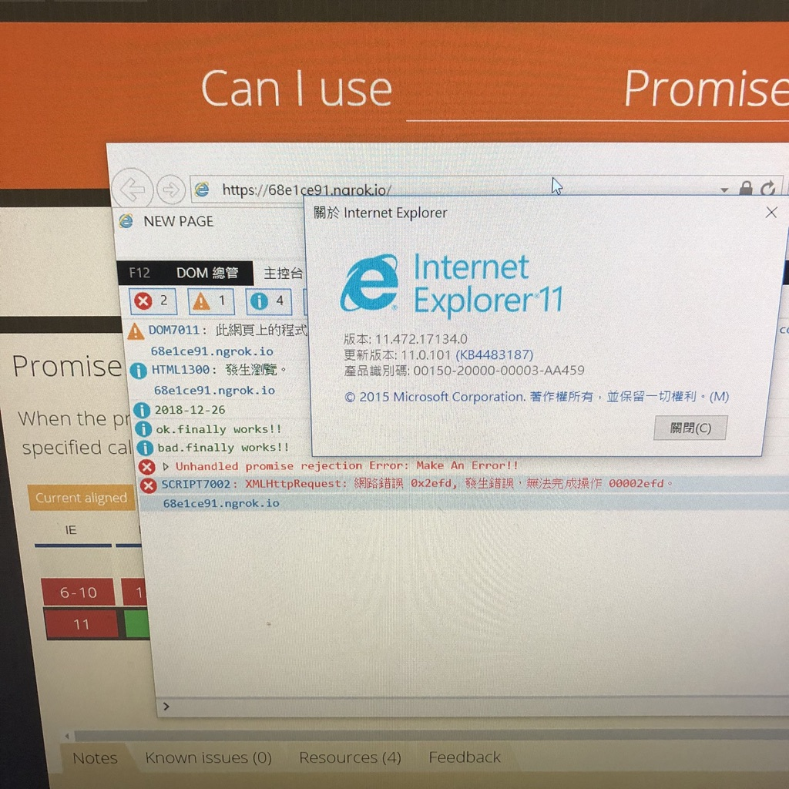

# fuck you ie 11

```ts
// src/index.ts
import moment from 'moment'

console.info(moment().format('YYYY-MM-DD'))

const games = [
  'Warcraft 3: Reforged',
  '湯姆克蘭西：全境封鎖2',
  'World War Z',
]

const ok = Promise.resolve()
const bad = Promise.reject(new Error('Make An Error!!'))

ok.finally(() => { console.info('ok.finally works!!') })
bad.finally(() => { console.info('bad.finally works!!') })
```


